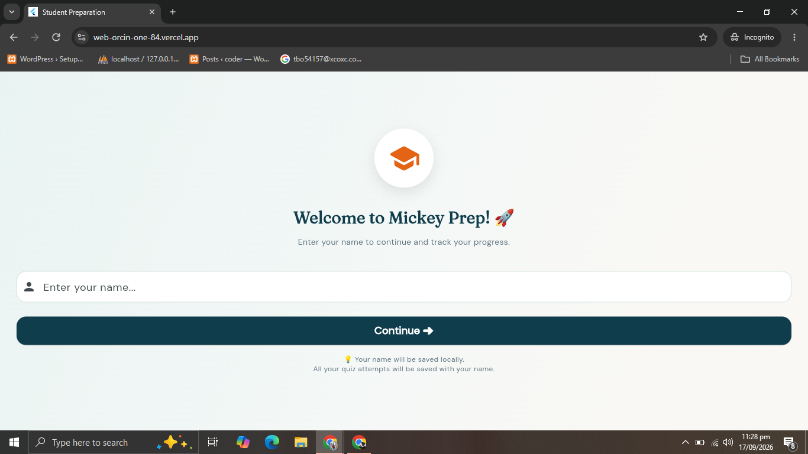
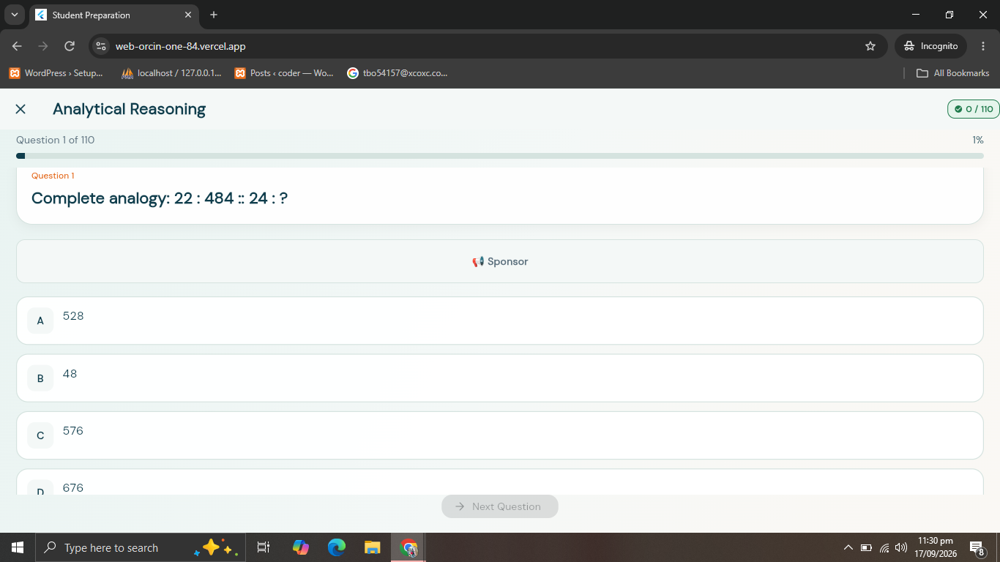
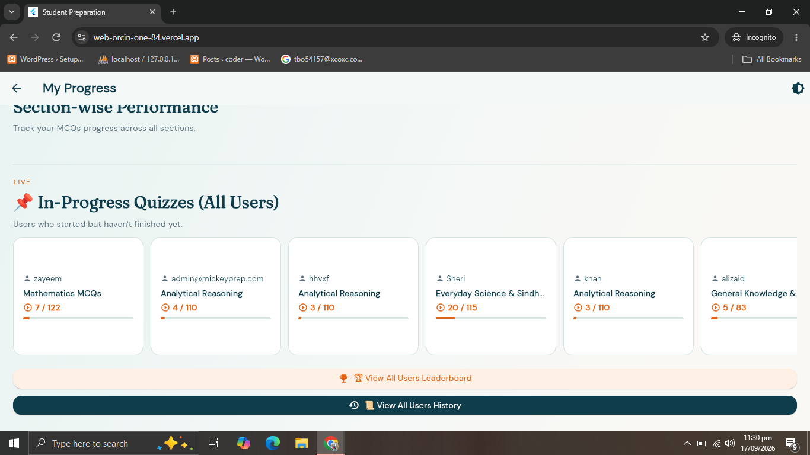

# Student Preparation — MCQ Practice App

A Flutter-based MCQ practice app for students preparing for NTS, STS/SIBA, Sindh High Court, university entry tests, and semester exams.

## Features
- Category-wise MCQ practice
- Timed quizzes and result review
- Firebase Authentication
- Firebase Realtime Database / Firestore integration
- Leaderboard and progress history
- Admin panel for question management
- Offline study support

## App Screenshots

  
  
  

## Tech Stack
- Flutter & Dart
- Firebase Authentication
- Cloud Firestore
- Firebase Realtime Database
- Google Mobile Ads (AdMob)

## Purpose
Built to help students prepare in a more organised and practical way through topic-based practice and performance tracking.

## Developer
**Ali Zaid** — Flutter Developer  
- Portfolio: https://my-portfolio-lyart-ten-kdzq0c293d.vercel.app/
- GitHub: https://github.com/ALIZAID-DEV
- Email: alizaid0096@gmail.com
